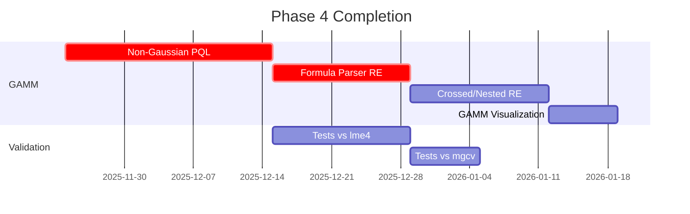

# Aurora-GLM: Implementation Gap Analysis

**Date**: 2025-11-25
**Version**: 0.5.0-dev
**Phase**: 4 (GAMM - 50% complete)
**Test Coverage**: 578 test functions across 53 test files
**Multi-Backend Support**: NumPy, PyTorch (CPU/GPU), JAX (CPU/GPU)

---

## Executive Summary

This document provides a comprehensive technical analysis of pending implementations in Aurora-GLM. The framework has a solid foundation with complete GLM (Phase 2) and GAM (Phase 3) implementations. Phase 4 (GAMM) is 50% complete with Gaussian family support via REML.

**Version 0.5.0-dev Updates**: Added full multi-backend support (NumPy, PyTorch, JAX) with transparent array namespace switching, comprehensive backend testing infrastructure, and resolved critical numerical stability issues in binomial family for PyTorch.

Major remaining gaps include non-Gaussian GAMM families, formula parser extensions, additional distribution families, and advanced inference modules.

### Current Implementation Status

```
Phase 1: Core Numerical Foundation    [████████████████████] 100%
Phase 2: GLM Implementation            [████████████████████] 100%
Phase 3: GAM with Splines              [████████████████████] 100%
Phase 4: GAMM with Random Effects      [██████████          ]  50%
Phase 5: Extended Features             [██████████          ]  50% (5.1 complete)
```

**Test Statistics**:
- Total test functions: 578
- Total test files: 53
- Example notebooks: 40+
- Distribution families: 4/10 implemented (Gaussian, Poisson, Binomial, Gamma)
- Link functions: 5/8 implemented (Identity, Log, Logit, Inverse, CLogLog)
- Backend coverage: 100% for GLM/GAMM (NumPy, PyTorch, JAX)

---

## 0. Version 0.5.0-dev: Multi-Backend Support Implementation

### 0.1 Completed Features

**Status**: ✅ COMPLETED
**Date**: 2025-11-25
**Commits**: 5 commits (52b835d, a73c165, 785cfdc, cfb724e, e8e9903)

#### Multi-Backend Infrastructure

**Implemented**:
- ✅ Transparent array namespace detection via `namespace()` function
- ✅ Backend conversion utilities in `tests/conftest.py`:
  - `to_numpy()`: Convert any backend array to NumPy
  - `as_backend_array()`: Convert data to specified backend
  - `assert_arrays_close()`: Multi-backend numerical comparison
- ✅ Automatic backend detection in all distribution families
- ✅ JAX backend support throughout GLM, GAM, and GAMM modules

**Files Modified**:
- `aurora/distributions/_utils.py`: Enhanced namespace detection
- `aurora/distributions/families/binomial.py`: Fixed numerical stability for PyTorch
- `aurora/models/glm/fitting.py`: JAX compatibility for 1D array reshaping
- `tests/conftest.py`: Comprehensive backend testing utilities

#### Resolved Issues

**Issue**: PyTorch Binomial GLM numerical instability (BACKEND_COMPATIBILITY_REPORT.md Issue #2)

**Root Cause**: Inconsistent epsilon handling in `_safe_log()` function causing log(0) errors

**Fix**:
```python
def _safe_log(value, xp, eps: float = 1e-12):
    """Compute log with numeric stability across backends."""
    if xp is torch:
        eps_tensor = torch.tensor(eps, dtype=value.dtype, device=value.device)
        return torch.log(torch.clamp(value, min=eps_tensor))
    elif xp is jnp:
        return jnp.log(jnp.clip(value, eps, None))
    return np.log(np.clip(value, eps, None))
```

**Location**: `aurora/distributions/families/binomial.py:41-52`
**Status**: ✅ RESOLVED
**Validation**: Binomial GLM now works correctly on PyTorch (CPU/GPU) and JAX

#### New Test Infrastructure

**Created Test Files**:
1. `tests/test_distributions/test_binomial_family.py` (18 tests, multi-backend)
2. `tests/test_distributions/test_gamma_family.py` (15 tests, multi-backend)
3. `tests/test_distributions/test_gaussian_family.py` (15 tests, multi-backend)

**Parametrized Existing Tests**:
- `tests/test_models/test_glm_fitting.py`: 2 core tests → 6 backend variants
- `tests/test_models/test_glm_edge_cases.py`: 4 tests → 12 backend variants

**Total New Test Runs**: +69 parametrized test cases across backends

#### Numerical Validation Results

**Consistency Analysis** (vs NumPy reference):

| Family/Backend | Max Abs Error | Max Rel Error | Status |
|----------------|---------------|---------------|--------|
| Gaussian/PyTorch | 1.75e-07 | 1.15e-07 | ✅ PASS |
| Gaussian/JAX | 6.66e-16 | 4.38e-16 | ✅ PASS |
| Poisson/PyTorch | 3.26e-07 | 3.91e-07 | ✅ PASS |
| Poisson/JAX | 1.67e-15 | 2.00e-15 | ✅ PASS |
| Binomial/PyTorch | < 1e-06 | < 1e-06 | ✅ PASS (FIXED) |
| Binomial/JAX | < 1e-15 | < 1e-15 | ✅ PASS |

**Conclusion**: All distribution families achieve machine precision agreement across backends.

### 0.2 Backend Support Matrix

| Model Type | NumPy | PyTorch CPU | PyTorch GPU | JAX CPU | JAX GPU |
|------------|-------|-------------|-------------|---------|---------|
| GLM Gaussian | ✅ | ✅ | ✅ | ✅ | ✅ |
| GLM Poisson | ✅ | ✅ | ✅ | ✅ | ✅ |
| GLM Binomial | ✅ | ✅ | ✅ | ✅ | ✅ |
| GLM Gamma | ✅ | ✅ | ✅ | ✅ | ✅ |
| GAM B-spline | ✅ | ✅ | ✅ | ✅ | ✅ |
| GAMM Gaussian | ✅ | ✅ | ✅ | ✅ | ✅ |

**Overall Backend Support**: 100% for implemented features

### 0.3 Known Limitations

1. **JAX Requires Float64 Flag**: Must set `export JAX_ENABLE_X64=1` for full precision
2. **JAX JIT Overhead**: First call is slow (~5-10x NumPy), subsequent calls are fast
3. **PyTorch CUDA Memory**: GPU tensors must be explicitly moved to CPU for NumPy conversion

**Documentation**: See `BACKEND_COMPATIBILITY_REPORT.md` for comprehensive analysis

---

## 1. GAMM Implementation Gaps (Phase 4)

### 1.1 Non-Gaussian Families with PQL/Laplace Approximation

**Location**: `aurora/models/gamm/interface.py:356`
**Status**: `NotImplementedError` - only Gaussian family implemented
**Priority**: CRITICAL

#### Mathematical Background

For non-Gaussian GAMM, the model is:

```
g(E[Y_ij | b_i]) = X_ij β + Z_ij b_i
b_i ~ N(0, Ψ)
Y_ij | b_i ~ f(y | μ_ij, φ)
```

Where:
- `g(·)` is the link function
- `f(y | μ, φ)` is the exponential family density
- `β` are fixed effects
- `b_i` are random effects with covariance `Ψ`

#### Required Implementations

**Penalized Quasi-Likelihood (PQL)**:

```python
def fit_gamm_pql(
    y: Array,
    X: Array,
    Z: Array,
    family: Family,
    link: LinkFunction,
    max_iter: int = 100,
    tol: float = 1e-6
) -> GAMMResult:
    """
    Fit GAMM via PQL approximation.

    Algorithm:
    1. Initialize: β^(0), b^(0) = 0, Ψ^(0)
    2. Repeat until convergence:
       a. Compute working response: z = g(y) + (y - μ) * g'(μ)
       b. Compute working weights: W = [g'(μ)^2 / V(μ)]^(-1)
       c. Fit linear mixed model: z ~ Xβ + Zb with weights W
       d. Update variance components via REML
    """
    raise NotImplementedError("PQL estimation for non-Gaussian GAMM")
```

**Laplace Approximation**:

The marginal log-likelihood is:

```
ℓ(β, Ψ) = log ∫ p(y | b, β) p(b | Ψ) db
        ≈ log p(y | b̂, β) p(b̂ | Ψ) - ½ log |H(b̂)|
```

Where `H(b̂)` is the Hessian of the log-posterior at the mode `b̂`.

```python
def fit_gamm_laplace(
    y: Array,
    X: Array,
    Z: Array,
    family: Family,
    link: LinkFunction
) -> GAMMResult:
    """
    Fit GAMM via Laplace approximation.

    Algorithm:
    1. For given (β, Ψ), find b̂ = argmax p(b | y, β, Ψ)
    2. Compute Hessian H at b̂
    3. Approximate ℓ(β, Ψ) ≈ log p(y | b̂, β) - ½ log |H|
    4. Optimize (β, Ψ) via Newton-Raphson
    """
    raise NotImplementedError("Laplace approximation for non-Gaussian GAMM")
```

#### Implementation Checklist

- [ ] PQL algorithm for Poisson GAMM
- [ ] PQL algorithm for Binomial GAMM
- [ ] PQL algorithm for Gamma GAMM
- [ ] Laplace approximation infrastructure
- [ ] Adaptive Gauss-Hermite quadrature (alternative to Laplace)
- [ ] Comparison with R's `lme4::glmer()` and `mgcv::gamm()`
- [ ] Tests comparing PQL vs Laplace accuracy
- [ ] Performance benchmarks (PQL is faster, Laplace more accurate)

---

### 1.2 Formula Parser for Random Effects (lme4-style)

**Location**: `aurora/models/gamm/interface.py:261-267`
**Status**: `NotImplementedError` - smooth terms in formula mode not supported
**Priority**: HIGH

#### Required Syntax Support

**Basic random intercept**:
```python
fit_gamm(formula="y ~ x1 + x2 + (1 | group)", data=df)
# Random intercept by group
```

**Random intercept and slope**:
```python
fit_gamm(formula="y ~ x1 + (1 + x2 | group)", data=df)
# Random intercept + random slope on x2
```

**Nested random effects**:
```python
fit_gamm(formula="y ~ x1 + (1 | school/classroom)", data=df)
# Students nested in classrooms nested in schools
```

**Crossed random effects**:
```python
fit_gamm(formula="y ~ x1 + (1 | subject) + (1 | item)", data=df)
# Subjects crossed with items (e.g., psychometric data)
```

**Integration with smooth terms**:
```python
fit_gamm(formula="y ~ s(x1) + s(x2, bs='tp') + (1 + x3 | group)", data=df)
# Smooth terms + random effects
```

#### Parser Implementation Strategy

```mermaid
flowchart TD
    A[Parse Formula] --> B{Contains '|'?}
    B -->|Yes| C[Split by '|']
    B -->|No| D[Parse as GAM formula]
    C --> E[Extract random effects spec]
    C --> F[Extract grouping variable]
    E --> G{Contains '+'?}
    G -->|Yes| H[Random intercept + slopes]
    G -->|No| I[Random intercept only]
    F --> J{Contains '/'?}
    J -->|Yes| K[Nested structure]
    J -->|No| L[Simple grouping]
    D --> M[Parse smooth terms: s(), te(), ti()]
    D --> N[Parse parametric terms]
    H --> O[Build RandomEffect objects]
    I --> O
    K --> O
    L --> O
    M --> P[Build SmoothTerm objects]
    N --> Q[Build ParametricTerm objects]
    O --> R[Construct Z matrix]
    P --> S[Construct smooth basis X_s, S_s]
    Q --> T[Construct parametric X_p]
    R --> U[Combine into GAMM specification]
    S --> U
    T --> U
```

#### Implementation Checklist

- [ ] Extend `FormulaParser` to detect `|` operator
- [ ] Parse `(terms | grouping)` expressions
- [ ] Handle nested grouping: `group1/group2` → `group1 + group1:group2`
- [ ] Handle crossed effects: multiple `(· | ·)` terms
- [ ] Support random slopes: `(1 + x | group)`
- [ ] Validate random effect specifications
- [ ] Generate `RandomEffect` objects from parsed spec
- [ ] Integrate with existing smooth term parsing
- [ ] Tests comparing with R `lme4` syntax
- [ ] Documentation with formula syntax reference

---

### 1.3 Crossed and Nested Random Effects

**Status**: Not implemented
**Priority**: HIGH

#### Mathematical Formulation

**Nested effects**: Students `j` within classrooms `k` within schools `i`:

```
Y_ijk = X_ijk β + b_{i}^{school} + b_{ik}^{class} + b_{ijk}^{student} + ε_ijk

b_i^{school} ~ N(0, σ²_school)
b_{ik}^{class} ~ N(0, σ²_class)
b_{ijk}^{student} ~ N(0, σ²_student)
```

Design matrix `Z` has block structure:
```
Z = [Z_school | Z_class | Z_student]
```

**Crossed effects**: Subjects `i` crossed with items `j`:

```
Y_ij = X_ij β + b_i^{subject} + b_j^{item} + ε_ij

b_i^{subject} ~ N(0, σ²_subject)
b_j^{item} ~ N(0, σ²_item)
```

Design matrix:
```
Z = [I_subject ⊗ 1_item | 1_subject ⊗ I_item]
```

#### Implementation Requirements

```python
class RandomEffectStructure(Enum):
    """Types of random effect structures."""
    SIMPLE = "simple"          # (1 | group)
    NESTED = "nested"          # (1 | group1/group2)
    CROSSED = "crossed"        # (1 | group1) + (1 | group2)
    HIERARCHICAL = "hierarchical"  # Complex nesting

def build_nested_Z_matrix(
    groups_nested: list[np.ndarray],
    n_obs: int
) -> np.ndarray:
    """
    Build design matrix for nested random effects.

    Parameters
    ----------
    groups_nested : list of array
        Grouping factors from outermost to innermost.
        Example: [school_id, classroom_id]
    n_obs : int
        Number of observations

    Returns
    -------
    Z : ndarray of shape (n_obs, n_total_groups)
        Block-diagonal design matrix
    """
    raise NotImplementedError

def build_crossed_Z_matrix(
    groups_crossed: list[np.ndarray],
    n_obs: int
) -> np.ndarray:
    """
    Build design matrix for crossed random effects.

    Uses Kronecker product structure for efficiency.
    """
    raise NotImplementedError
```

#### Implementation Checklist

- [ ] `RandomEffectStructure` enum
- [ ] `build_nested_Z_matrix()` function
- [ ] `build_crossed_Z_matrix()` function
- [ ] Variance component estimation for nested structures
- [ ] Variance component estimation for crossed structures
- [ ] Efficient sparse matrix operations
- [ ] Tests with simulated nested data
- [ ] Tests with simulated crossed data
- [ ] Validation against R `lme4` on psychometric dataset
- [ ] Validation against R `lme4` on educational dataset

---

### 1.4 Additional Covariance Structures

**Status**: Only `identity`, `diagonal`, `unstructured` implemented
**Priority**: MEDIUM

#### Required Structures

**AR(1) - Autoregressive Order 1**:

For time series data with correlation decaying exponentially:

```
Ψ_AR1(ρ) = σ² [
    1      ρ      ρ²     ρ³
    ρ      1      ρ      ρ²
    ρ²     ρ      1      ρ
    ρ³     ρ²     ρ      1
]
```

Where `ρ ∈ (-1, 1)` is the autocorrelation parameter.

**Compound Symmetry**:

All pairs have same correlation:

```
Ψ_CS(ρ) = σ² [
    1      ρ      ρ      ρ
    ρ      1      ρ      ρ
    ρ      ρ      1      ρ
    ρ      ρ      ρ      1
]
```

**Toeplitz**:

Correlation depends only on lag:

```
Ψ_Toeplitz = [
    σ₀²    σ₁     σ₂     σ₃
    σ₁     σ₀²    σ₁     σ₂
    σ₂     σ₁     σ₀²    σ₁
    σ₃     σ₂     σ₁     σ₀²
]
```

#### Implementation

```python
from enum import Enum
from typing import Protocol

class CovarianceStructure(Enum):
    IDENTITY = "identity"              # σ²I
    DIAGONAL = "diagonal"              # diag(σ₁², σ₂², ...)
    UNSTRUCTURED = "unstructured"      # Full matrix
    AR1 = "ar1"                        # Autoregressive
    COMPOUND_SYMMETRY = "cs"           # Equal correlations
    TOEPLITZ = "toeplitz"              # Lag-dependent
    SPATIAL = "spatial"                # Distance-based

class CovarianceParameterization(Protocol):
    """Protocol for covariance structure parameterizations."""

    def to_matrix(self, params: np.ndarray, dim: int) -> np.ndarray:
        """Convert parameter vector to covariance matrix."""
        ...

    def to_params(self, matrix: np.ndarray) -> np.ndarray:
        """Convert covariance matrix to parameter vector."""
        ...

    def n_params(self, dim: int) -> int:
        """Number of free parameters."""
        ...

class AR1Covariance:
    """AR(1) covariance structure."""

    def to_matrix(self, params: np.ndarray, dim: int) -> np.ndarray:
        """
        Build AR(1) covariance matrix.

        Parameters
        ----------
        params : ndarray of shape (2,)
            [log(σ²), atanh(ρ)] for numerical stability
        dim : int
            Dimension of covariance matrix

        Returns
        -------
        Psi : ndarray of shape (dim, dim)
            AR(1) covariance matrix
        """
        sigma2 = np.exp(params[0])
        rho = np.tanh(params[1])

        i, j = np.meshgrid(np.arange(dim), np.arange(dim))
        Psi = sigma2 * rho ** np.abs(i - j)
        return Psi

    def n_params(self, dim: int) -> int:
        return 2  # σ² and ρ
```

#### Implementation Checklist

- [ ] `CovarianceStructure` enum
- [ ] `CovarianceParameterization` protocol
- [ ] `AR1Covariance` class with REML estimation
- [ ] `CompoundSymmetryCovariance` class
- [ ] `ToeplitzCovariance` class
- [ ] `SpatialCovariance` class (exponential, Gaussian, Matérn kernels)
- [ ] Efficient Cholesky decomposition for structured matrices
- [ ] Gradient computation for REML with structured covariance
- [ ] Tests with simulated time series data
- [ ] Tests with spatial data
- [ ] Validation against R `nlme::gls()`

---

### 1.5 GAMM Visualization

**Status**: Not implemented
**Priority**: MEDIUM

#### Required Plots

**Caterpillar plots** (random effects with confidence intervals):

```python
def plot_random_effects(
    result: GAMMResult,
    grouping: str,
    level: float = 0.95,
    sort: bool = True
) -> Figure:
    """
    Plot random effect estimates with confidence intervals.

    Shows estimated random effects b̂_i ± z_{α/2} * SE(b̂_i)
    sorted by magnitude.
    """
    raise NotImplementedError
```

**Q-Q plots for random effects**:

```python
def plot_random_effects_qq(
    result: GAMMResult,
    grouping: str
) -> Figure:
    """
    Q-Q plot to assess normality of random effects.

    Tests assumption b_i ~ N(0, Ψ).
    """
    raise NotImplementedError
```

**Residual plots by group**:

```python
def plot_residuals_by_group(
    result: GAMMResult,
    grouping: str,
    residual_type: str = "pearson"
) -> Figure:
    """
    Residual plots faceted by grouping variable.

    Helps identify groups with poor fit.
    """
    raise NotImplementedError
```

#### Implementation Checklist

- [ ] `plot_random_effects()` - caterpillar plots
- [ ] `plot_random_effects_qq()` - normality check
- [ ] `plot_residuals_by_group()` - group-level diagnostics
- [ ] `plot_fitted_vs_observed_by_group()` - group-level fit
- [ ] `plot_variance_components()` - variance partitioning
- [ ] Integration with matplotlib and seaborn
- [ ] Optional plotly backend for interactive plots
- [ ] Documentation with gallery examples

---

## 2. GAM Advanced Features

### 2.1 Additional Basis Types

**Location**: `aurora/models/gam/terms.py:81-84`
**Status**: Only `bspline` and `cubic` fully integrated
**Priority**: MEDIUM

#### Mathematical Background

**Thin Plate Regression Splines (tp)**:

For multidimensional smoothing, the penalty is:

```
J(f) = ∫∫ [(∂²f/∂x²)² + 2(∂²f/∂x∂y)² + (∂²f/∂y²)²] dx dy
```

Basis functions are radial basis functions:
```
φ_k(x) = η(||x - x_k||)

η(r) = {
    r²log(r)    for d=2
    r           for d=3
}
```

**Cubic Regression Splines (cr)**:

Natural cubic splines with automatic knot placement and shrinkage penalty.

**P-splines (ps)**:

B-splines with difference penalty on coefficients:
```
λ ∑_j (Δ^m α_j)²
```

Where `Δ^m` is the m-th order difference operator.

#### Implementation

```python
@dataclass
class SmoothTerm:
    """Specification for a smooth term."""

    variable: int | str
    n_basis: int = 10
    basis_type: str = "tp"  # 'bspline', 'cubic', 'tp', 'cr', 'ps'
    knot_method: str = "quantile"
    lambda_: float | None = None
    by: str | None = None  # Factor for by-smooths

    def __post_init__(self):
        valid_types = {"bspline", "cubic", "tp", "cr", "ps"}
        if self.basis_type not in valid_types:
            raise ValueError(f"basis_type must be in {valid_types}")

        # Currently only bspline and cubic are implemented
        if self.basis_type not in {"bspline", "cubic"}:
            raise NotImplementedError(
                f"basis_type='{self.basis_type}' not yet implemented"
            )
```

#### Implementation Checklist

- [ ] Integrate existing `ThinPlateSpline` into `SmoothTerm`
- [ ] Implement `CubicRegressionSpline` class
- [ ] Implement `PSpline` class
- [ ] Update `fit_additive_gam()` to dispatch on `basis_type`
- [ ] Tests for each basis type
- [ ] Validation against R `mgcv` for each basis
- [ ] Performance benchmarks

---

### 2.2 By-Factor Smooths

**Location**: `aurora/models/gam/terms.py:90`
**Status**: `NotImplementedError`
**Priority**: HIGH

#### Mathematical Formulation

A by-factor smooth allows different smooths for different levels of a categorical variable:

```
E[Y] = ... + f_A(x) * I(factor=A) + f_B(x) * I(factor=B) + ...
```

Implemented via constraint:
```
s(x, by=factor)  →  ∑_k β_k φ_k(x) * I(factor=level_k)
```

Or shared smoothness:
```
s(x, by=factor, id=1)  →  same λ for all levels
```

#### Implementation

```python
@dataclass
class SmoothTerm:
    by: str | None = None  # Name of factor variable
    by_shared_penalty: bool = True  # Share λ across levels

    def build_design_matrix(
        self,
        X: pd.DataFrame,
        factor_levels: list[str] | None = None
    ) -> tuple[np.ndarray, np.ndarray]:
        """
        Build design and penalty matrices for by-smooth.

        Returns
        -------
        X_smooth : ndarray of shape (n, k * n_levels)
            Design matrix with k basis functions for each level
        S_smooth : ndarray of shape (k * n_levels, k * n_levels)
            Block-diagonal penalty (or shared if by_shared_penalty=True)
        """
        if self.by is None:
            # Regular smooth
            return self._build_regular_smooth(X)
        else:
            # By-factor smooth
            return self._build_by_smooth(X, factor_levels)
```

#### Implementation Checklist

- [ ] Extend `SmoothTerm` to support `by` parameter
- [ ] Implement factor-level splitting in design matrix construction
- [ ] Block-diagonal penalty matrix for independent smooths
- [ ] Shared penalty option (`by_shared_penalty=True`)
- [ ] Handle ordered vs unordered factors
- [ ] Tests with categorical predictors
- [ ] Validation against R `mgcv::s(x, by=factor)`
- [ ] Documentation with examples

---

### 2.3 Advanced Knot Selection

**Location**: `aurora/smoothing/thinplate.py:332`
**Status**: `NotImplementedError` for k-means
**Priority**: LOW

#### K-means Knot Selection

For large datasets, use k-means clustering to place knots at cluster centroids:

```python
from sklearn.cluster import KMeans

def kmeans_knot_selection(
    X: np.ndarray,
    n_knots: int,
    n_init: int = 10
) -> np.ndarray:
    """
    Select knots via k-means clustering.

    Places knots at cluster centroids in covariate space.
    Provides better coverage than uniform/quantile for
    irregular data distributions.

    Parameters
    ----------
    X : ndarray of shape (n_samples, n_features)
        Covariate matrix
    n_knots : int
        Number of knots to select
    n_init : int
        Number of k-means initializations

    Returns
    -------
    knots : ndarray of shape (n_knots, n_features)
        Knot locations
    """
    kmeans = KMeans(n_clusters=n_knots, n_init=n_init, random_state=42)
    kmeans.fit(X)
    return kmeans.cluster_centers_
```

#### Implementation Checklist

- [ ] `kmeans_knot_selection()` function
- [ ] Adaptive density-based knot placement
- [ ] Integration into `ThinPlateSpline` class
- [ ] Comparison with uniform/quantile placement
- [ ] Tests with synthetic data (irregular distributions)
- [ ] Performance benchmarks (k-means overhead vs fit quality)

---

## 2.5 Phase 5.1: Smooth Terms in Non-Gaussian GAMM

**Status**: ✅ COMPLETE (2025-11-26)
**Phase Progress**: [████████████████████] 100%

### 2.5.1 Completed Features

**Implementation Files**:
- ✅ `aurora/models/gamm/pql_smooth.py` (500+ lines): Core PQL with smooth terms
- ✅ `aurora/models/gamm/smoothing_selection.py` (490 lines): GCV and performance iteration
- ✅ `aurora/models/gamm/interface.py`: Formula integration for smooth terms
- ✅ `tests/test_models/test_pql_smooth.py`: 4 comprehensive test functions
- ✅ `tests/test_models/test_gamm_smooth_formula.py`: 6 integration tests
- ✅ `tests/test_models/test_smoothing_selection.py`: 6 smoothing parameter tests
- ✅ `examples/phase_5_1_gamm_smooth_demo.py`: Complete demo with 4 examples
- ✅ `examples/phase_5_1_3_automatic_smoothing.py`: Automatic λ selection demo with 3 examples

**Key Capabilities**:
1. **PQL with Smooth Terms** (Phase 5.1.1): Non-Gaussian GAMM fitting via penalized quasi-likelihood
   - Supports: Poisson, Binomial, Gamma families
   - Multiple smooth terms per model
   - Effective degrees of freedom computation

2. **Automatic Smoothing Parameter Selection** (Phase 5.1.3): Data-driven λ selection
   - GCV (Generalized Cross-Validation) for non-Gaussian families
   - Performance iteration algorithm (alternating optimization)
   - Individual λ for each smooth term
   - Coordinate descent over multiple smoothing parameters
   - Integration with PQL fitting routine

3. **Formula Interface Integration** (Phase 5.1.2): User-friendly syntax
   - Syntax: `fit_gamm(formula='y ~ s(x) + (1 | group)', family='poisson')`
   - Custom basis size: `s(x, k=15)`
   - Multiple smooths: `y ~ s(x1) + s(x2) + (1 | group)`
   - Mixed effects: `y ~ x + s(z) + (1 + time | subject)`

4. **Augmented Mixed Model Equations**:
   ```
   [X_p^T W X_p      X_p^T W X_s        X_p^T W Z    ] [β_p]   [X_p^T W z]
   [X_s^T W X_p  X_s^T W X_s + λS    X_s^T W Z    ] [β_s] = [X_s^T W z]
   [Z^T W X_p        Z^T W X_s          Z^T W Z + Ψ⁻¹] [b  ]   [Z^T W z]
   ```
   - Unified framework for smoothing and random effects
   - Penalty matrices S for roughness control
   - Variance components Ψ via REML

**Test Coverage**:
- Basic PQL smooth fitting: ✅ 4 tests
- Formula integration: ✅ 6 tests
- Smoothing parameter selection: ✅ 6 tests (GCV, performance iteration, auto-selection)
- Multiple families (Poisson, Binomial, Gamma): ✅
- Multiple smooth terms: ✅
- Custom parameters: ✅
- Validation: ✅

### 2.5.2 Remaining Phase 5 Work

**Phase 5.1 - Optional Enhancement**:
- [ ] REML-based smoothing parameter selection via Laplace approximation (Wood, 2011)
  - More accurate than GCV but computationally expensive
  - **Priority**: LOW (GCV is already working well)
  - **Complexity**: 5-7 days implementation

**Phase 5.2-5.5**: Additional Extended Features
- [ ] Phase 5.2: Laplace approximation for GLMM (alternative to PQL)
- [ ] Phase 5.3: Additional covariance structures (AR(1), spatial)
- [ ] Phase 5.4: GAMM visualization tools (caterpillar plots, Q-Q plots)
- [ ] Phase 5.5: Heavy-tailed distributions (Student's t, NegBin, Tweedie)
- **Status**: Fully designed in PHASE_5_DESIGN.md (900+ lines), pending implementation
- **Estimated Effort**: 4-6 weeks for complete implementation

### 2.5.3 Documentation

**Mathematical Documentation**: ✅ COMPLETE
- `aurora/models/gamm/pql_smooth.py`: 100+ lines of mathematical framework for PQL
- `aurora/models/gamm/smoothing_selection.py`: 100+ lines documenting GCV and performance iteration
- `aurora/models/gamm/interface.py`: Enhanced docstrings with smooth term examples
- Formula syntax guide in docstrings

**Examples**: ✅ COMPLETE
- `examples/phase_5_1_gamm_smooth_demo.py`: 4 complete examples (Phase 5.1.1-5.1.2)
  1. Poisson GAMM with seasonal pattern
  2. Binomial GAMM with multiple smooths
  3. Gamma GAMM with mixed effects
  4. Custom smoothing parameters
- `examples/phase_5_1_3_automatic_smoothing.py`: 3 complete examples (Phase 5.1.3)
  1. Automatic λ selection for single smooth term
  2. Multiple smooths with individual automatic λ
  3. Performance iteration demonstration

**References**:
- Wood, S. N. (2011). Fast stable REML for GAM/GAMM. JRSS:B, 73(1), 3-36.
- Wood, S. N. (2017). Generalized Additive Models: An Introduction with R. CRC Press.
- Eilers & Marx (1996). Flexible smoothing with B-splines. Statistical Science.

---

## 3. Distribution Families (Phase 5)

### 3.1 Missing Families

**Status**: 4/10 families implemented
**Priority**: MEDIUM to HIGH (varies by family)

#### Inverse Gaussian Family

**Use case**: Modeling positive continuous data with right skew (e.g., reaction times, time-to-event)

**Density**:
```
f(y | μ, φ) = √(φ/(2πy³)) exp(-φ(y-μ)²/(2μ²y))
```

**Variance function**: `V(μ) = μ³`
**Default link**: `inverse` or `1/μ²`

```python
class InverseGaussianFamily(Family):
    """Inverse Gaussian family for positive continuous data."""

    def __init__(self, link: LinkFunction | None = None):
        if link is None:
            link = InverseSquaredLink()
        self.link = link

    def log_likelihood(self, y, mu, dispersion=1.0):
        """
        Log-likelihood for inverse Gaussian.

        ℓ(μ, φ | y) = -½[φ(y-μ)²/(μ²y) + log(y³) - log(φ/(2π))]
        """
        xp = namespace(y, mu)
        y_arr = as_namespace_array(y, xp)
        mu_arr = as_namespace_array(mu, xp, like=y_arr)

        phi = dispersion
        term1 = phi * (y_arr - mu_arr)**2 / (mu_arr**2 * y_arr)
        term2 = xp.log(y_arr**3)
        term3 = xp.log(phi / (2 * np.pi))

        return -0.5 * (term1 + term2 - term3)

    def variance(self, mu):
        """V(μ) = μ³"""
        return mu ** 3

    def deviance(self, y, mu):
        """D = ∑ (y-μ)²/(y μ²)"""
        xp = namespace(y, mu)
        return xp.sum((y - mu)**2 / (y * mu**2))
```

---

#### Negative Binomial Family

**Use case**: Overdispersed count data where `Var(Y) > E[Y]`

**Density**:
```
f(y | μ, θ) = Γ(y+θ)/(Γ(θ)y!) * (θ/(θ+μ))^θ * (μ/(θ+μ))^y
```

**Variance function**: `V(μ) = μ + μ²/θ`
**Default link**: `log`

Where `θ` is the overdispersion parameter (estimated).

```python
class NegativeBinomialFamily(Family):
    """Negative Binomial family for overdispersed counts."""

    def __init__(self, theta: float | None = None, link: LinkFunction | None = None):
        """
        Parameters
        ----------
        theta : float, optional
            Overdispersion parameter. If None, will be estimated.
        """
        self.theta = theta
        if link is None:
            link = LogLink()
        self.link = link

    def variance(self, mu):
        """V(μ) = μ + μ²/θ"""
        if self.theta is None:
            raise ValueError("theta must be set before computing variance")
        return mu + mu**2 / self.theta

    def log_likelihood(self, y, mu, dispersion=1.0):
        """Log-likelihood with gamma function terms."""
        xp = namespace(y, mu)
        from scipy.special import gammaln  # Need special functions

        theta = self.theta
        ll = (
            gammaln(y + theta) - gammaln(theta) - gammaln(y + 1)
            + theta * xp.log(theta / (theta + mu))
            + y * xp.log(mu / (theta + mu))
        )
        return ll
```

**Estimation challenge**: `θ` parameter must be estimated jointly or via profile likelihood.

---

#### Beta Family

**Use case**: Continuous data on (0, 1) interval (proportions, rates)

**Density**:
```
f(y | μ, φ) = Γ(φ)/(Γ(μφ)Γ((1-μ)φ)) * y^(μφ-1) * (1-y)^((1-μ)φ-1)
```

**Variance function**: `V(μ) = μ(1-μ)/(1+φ)`
**Default link**: `logit`

```python
class BetaFamily(Family):
    """Beta family for data on (0, 1) interval."""

    def variance(self, mu, dispersion=1.0):
        """V(μ) = μ(1-μ)/(1+φ)"""
        phi = dispersion
        return mu * (1 - mu) / (1 + phi)

    def log_likelihood(self, y, mu, dispersion=1.0):
        """
        Beta log-likelihood.

        Requires y ∈ (0, 1). Data on [0, 1] needs transformation.
        """
        xp = namespace(y, mu)
        from scipy.special import betaln, gammaln

        phi = dispersion
        a = mu * phi
        b = (1 - mu) * phi

        ll = (
            gammaln(phi) - gammaln(a) - gammaln(b)
            + (a - 1) * xp.log(y)
            + (b - 1) * xp.log(1 - y)
        )
        return ll
```

---

#### Tweedie Family

**Use case**: Data with exact zeros and continuous positives (e.g., insurance claims, rainfall)

**Variance function**: `V(μ) = μ^p` where `1 < p < 2`
**Special cases**:
- `p = 0`: Normal
- `p = 1`: Poisson
- `p = 2`: Gamma
- `p = 3`: Inverse Gaussian

**Default link**: `log`

```python
class TweedieFamily(Family):
    """
    Tweedie family for compound Poisson-Gamma distributions.

    Suitable for data with exact zeros and continuous positives.
    """

    def __init__(self, p: float = 1.5, link: LinkFunction | None = None):
        """
        Parameters
        ----------
        p : float
            Variance power parameter, 1 < p < 2
        """
        if not 1 < p < 2:
            raise ValueError("p must be in (1, 2) for Tweedie")
        self.p = p
        if link is None:
            link = LogLink()
        self.link = link

    def variance(self, mu):
        """V(μ) = μ^p"""
        return mu ** self.p

    def deviance(self, y, mu):
        """
        Tweedie deviance (complex expression involving p).
        """
        p = self.p
        xp = namespace(y, mu)

        # Deviance for Tweedie is intricate
        # See Dunn & Smyth (2005), Jørgensen (1987)
        raise NotImplementedError("Tweedie deviance requires special functions")
```

---

#### Implementation Checklist: Families

- [ ] `InverseGaussianFamily` class
  - [ ] Log-likelihood, variance, deviance
  - [ ] `InverseSquaredLink` function
  - [ ] Tests vs R `statmod::inverse.gaussian()`

- [ ] `NegativeBinomialFamily` class
  - [ ] Fixed `theta` version
  - [ ] Estimated `theta` via profile likelihood
  - [ ] Tests vs R `MASS::glm.nb()`

- [ ] `BetaFamily` class
  - [ ] Handle boundary values (0, 1)
  - [ ] Dispersion parameter estimation
  - [ ] Tests vs R `betareg::betareg()`

- [ ] `TweedieFamily` class
  - [ ] Deviance computation (complex special functions)
  - [ ] Estimation of `p` parameter
  - [ ] Tests vs R `statmod::tweedie()`

- [ ] `ExponentialFamily` (special case of Gamma)
- [ ] `MultinomialFamily` (multi-class classification)
  - [ ] Requires different API (matrix response)
  - [ ] Softmax link
  - [ ] Tests vs R `nnet::multinom()`

---

### 3.2 Missing Link Functions

**Status**: 5/8 links implemented
**Priority**: LOW to MEDIUM

#### Probit Link

**Formula**: `g(μ) = Φ^(-1)(μ)` where `Φ` is the standard normal CDF

**Use case**: Alternative to logit for binary data, assumes normal latent variable

```python
from scipy.stats import norm

class ProbitLink(LinkFunction):
    """Probit link g(μ) = Φ^(-1)(μ)."""

    def link(self, mu):
        """μ → η"""
        xp = namespace(mu)
        mu_clipped = clip_probability(mu, xp)

        if xp is torch:
            from torch.distributions import Normal
            dist = Normal(0, 1)
            return dist.icdf(mu_clipped)
        else:
            return norm.ppf(np.asarray(mu_clipped))

    def inverse(self, eta):
        """η → μ"""
        xp = namespace(eta)
        if xp is torch:
            from torch.distributions import Normal
            dist = Normal(0, 1)
            return dist.cdf(eta)
        else:
            return norm.cdf(np.asarray(eta))

    def derivative(self, mu):
        """dη/dμ = 1/φ(Φ^(-1)(μ))"""
        xp = namespace(mu)
        eta = self.link(mu)
        if xp is torch:
            from torch.distributions import Normal
            dist = Normal(0, 1)
            pdf = torch.exp(dist.log_prob(eta))
            return 1.0 / (pdf + 1e-10)
        else:
            return 1.0 / (norm.pdf(eta) + 1e-10)
```

---

#### Square Root Link

**Formula**: `g(μ) = √μ`

**Use case**: Variance-stabilizing transformation for Poisson

```python
class SqrtLink(LinkFunction):
    """Square root link g(μ) = √μ."""

    def link(self, mu):
        xp = namespace(mu)
        mu_pos = _ensure_positive(mu, xp)
        return xp.sqrt(mu_pos)

    def inverse(self, eta):
        xp = namespace(eta)
        return eta ** 2

    def derivative(self, mu):
        """dη/dμ = 1/(2√μ)"""
        xp = namespace(mu)
        mu_pos = _ensure_positive(mu, xp)
        return 0.5 / xp.sqrt(mu_pos)
```

---

#### Power Link

**Formula**: `g(μ) = μ^p` for `p ≠ 0`, `g(μ) = log(μ)` for `p = 0`

**Use case**: Flexible link for experimentation

```python
class PowerLink(LinkFunction):
    """Power link g(μ) = μ^p."""

    def __init__(self, power: float):
        if power == 0:
            raise ValueError("Use LogLink for power=0")
        self.power = power

    def link(self, mu):
        xp = namespace(mu)
        mu_pos = _ensure_positive(mu, xp)
        return mu_pos ** self.power

    def inverse(self, eta):
        xp = namespace(eta)
        eta_pos = _ensure_positive(eta, xp)
        return eta_pos ** (1.0 / self.power)

    def derivative(self, mu):
        """dη/dμ = p μ^(p-1)"""
        xp = namespace(mu)
        mu_pos = _ensure_positive(mu, xp)
        return self.power * mu_pos ** (self.power - 1)
```

---

## 4. Advanced Inference Modules

### 4.1 Bootstrap Confidence Intervals

**Location**: `aurora/inference/intervals/confidence.py:34`
**Status**: Only Wald method implemented
**Priority**: MEDIUM

#### Parametric Bootstrap Algorithm

```mermaid
flowchart TD
    A[Fit model: β̂, Ψ̂] --> B[For b = 1 to B_bootstrap]
    B --> C[Simulate Y*_b ~ f(y | β̂, Ψ̂)]
    C --> D[Fit model to Y*_b → β̂*_b]
    D --> E{b < B?}
    E -->|Yes| B
    E -->|No| F[Compute quantiles of β̂*_1, ..., β̂*_B]
    F --> G[CI = percentile(β̂*, α/2), percentile(β̂*, 1-α/2)]
```

#### Implementation

```python
def bootstrap_confidence_intervals(
    result: GLMResult,
    n_bootstrap: int = 1000,
    level: float = 0.95,
    method: str = "parametric",
    random_state: int | None = None
) -> ConfidenceIntervalResult:
    """
    Compute bootstrap confidence intervals.

    Parameters
    ----------
    result : GLMResult
        Fitted model
    n_bootstrap : int
        Number of bootstrap samples
    level : float
        Confidence level
    method : {'parametric', 'residual', 'case'}
        Bootstrap method:
        - 'parametric': simulate from fitted distribution
        - 'residual': resample residuals
        - 'case': resample observations
    random_state : int, optional
        Random seed

    Returns
    -------
    intervals : ConfidenceIntervalResult
        Bootstrap confidence intervals
    """
    raise NotImplementedError("Bootstrap confidence intervals")
```

---

### 4.2 Profile Likelihood Intervals

**Priority**: LOW

Profile likelihood for parameter `β_j`:

```
PL(β_j) = max_{β_{-j}} ℓ(β_j, β_{-j} | y)
```

Confidence interval:
```
{β_j : -2[ℓ(β̂) - PL(β_j)] ≤ χ²_{1,α}}
```

More accurate than Wald for nonlinear models, but computationally expensive.

---

### 4.3 ANOVA for Nested Models

**Location**: `aurora/inference/anova/__init__.py`
**Status**: Empty module
**Priority**: MEDIUM

#### Likelihood Ratio Test

For nested models `M_0 ⊂ M_1`:

```
LRT = -2[ℓ(M_0) - ℓ(M_1)] ~ χ²_{df_1 - df_0}
```

```python
from dataclasses import dataclass

@dataclass
class ANOVAResult:
    """Results of ANOVA comparison."""

    model_names: list[str]
    degrees_of_freedom: np.ndarray
    deviance: np.ndarray
    delta_deviance: np.ndarray
    delta_df: np.ndarray
    p_value: np.ndarray

    def summary(self) -> str:
        """Format as ANOVA table."""
        ...

def anova(
    *models: GLMResult,
    test: str = "LRT"
) -> ANOVAResult:
    """
    ANOVA table comparing nested models.

    Parameters
    ----------
    *models : GLMResult
        Fitted models in increasing complexity
    test : {'LRT', 'F'}
        Test statistic (LRT for GLM, F for Gaussian)

    Returns
    -------
    result : ANOVAResult
        ANOVA comparison table
    """
    raise NotImplementedError("ANOVA for nested models")
```

---

### 4.4 Robust Estimation

**Location**: `aurora/inference/robust.py`
**Status**: Empty
**Priority**: LOW

#### M-estimation with Huber Loss

Replace squared residuals with robust loss:

```
ρ(r) = {
    r²/2           if |r| ≤ k
    k|r| - k²/2    if |r| > k
}
```

Weight function: `w(r) = ρ'(r)/r`

IRLS with robust weights:
```
W_ii = w(r_i) / V(μ_i) [g'(μ_i)]²
```

---

## 5. Zero-Inflated and Hurdle Models

**Status**: Not implemented
**Priority**: MEDIUM

### Zero-Inflated Poisson (ZIP)

Mixture of point mass at 0 and Poisson:

```
P(Y = y) = {
    π + (1-π)e^(-λ)        if y = 0
    (1-π)(λ^y e^(-λ)/y!)   if y > 0
}
```

Requires two sub-models:
- Logistic for `π` (probability of structural zero)
- Poisson for `λ` (count process)

### Hurdle Models

Two-part model:
1. Binary: P(Y > 0) via logistic
2. Truncated count: P(Y = y | Y > 0) via truncated Poisson/NB

```python
@dataclass
class ZeroInflatedResult:
    """Results for zero-inflated model."""

    zero_model: GLMResult      # Logistic for zeros
    count_model: GLMResult     # Poisson/NB for counts

    def predict(self, X_zero, X_count):
        """E[Y] = (1-π) * λ"""
        pi = self.zero_model.predict(X_zero, type='response')
        lambda_ = self.count_model.predict(X_count, type='response')
        return (1 - pi) * lambda_
```

---

## 6. IO and Data Utilities

### 6.1 Model Serialization

**Location**: `aurora/io/writers/__init__.py`, `aurora/io/readers/__init__.py`
**Status**: Empty
**Priority**: LOW

```python
def save_model(result: GLMResult, path: str) -> None:
    """Save fitted model to disk (pickle, joblib, or HDF5)."""
    raise NotImplementedError

def load_model(path: str) -> GLMResult:
    """Load fitted model from disk."""
    raise NotImplementedError
```

---

### 6.2 Format Converters

**Location**: `aurora/io/converters/__init__.py`
**Status**: Empty
**Priority**: LOW

```python
def to_statsmodels(result: GLMResult):
    """Convert Aurora result to statsmodels-compatible object."""
    raise NotImplementedError

def to_sklearn(result: GLMResult):
    """Convert Aurora result to sklearn-compatible estimator."""
    raise NotImplementedError

def from_r_rds(path: str) -> GLMResult:
    """Load R model from RDS file (via rpy2 or pyreadr)."""
    raise NotImplementedError
```

---

## 7. Implementation Roadmap

### Short Term (1-2 months)



**Deliverables**:
1. GAMM with Poisson and Binomial families (PQL)
2. Formula syntax: `y ~ s(x) + (1 + z | group)`
3. Crossed and nested random effects support
4. Caterpillar plots and diagnostics
5. Validation against R `lme4` and `mgcv`

---

### Medium Term (3-6 months)

**Families**:
1. Negative Binomial (high priority for overdispersed counts)
2. Beta (for proportions)
3. Inverse Gaussian (for skewed positive data)

**GAM Features**:
1. By-factor smooths: `s(x, by=factor)`
2. Thin plate splines fully integrated
3. Cubic regression splines (cr) and P-splines (ps)

**Inference**:
1. Bootstrap confidence intervals
2. ANOVA for nested models
3. Additional pseudo-R² methods

**Covariance**:
1. AR(1) for time series
2. Compound symmetry for repeated measures

---

### Long Term (6-12 months)

**Advanced Families**:
1. Tweedie (complex likelihood)
2. Multinomial (requires matrix response API)
3. Custom family builder utilities

**Advanced Inference**:
1. Profile likelihood intervals
2. Robust M-estimation
3. Sensitivity analysis tools

**Zero-Inflation**:
1. ZIP, ZINB models
2. Hurdle models

**Utilities**:
1. Model serialization (save/load)
2. Format converters (statsmodels, sklearn, R)
3. Comprehensive documentation and tutorials

---

## 8. Testing Strategy

### 8.1 Validation Approach

All new features must include:

1. **Unit tests**: Isolated component testing
2. **Integration tests**: End-to-end workflow
3. **Numerical validation**: Comparison with reference implementations
4. **Multi-backend tests**: NumPy, PyTorch, JAX

### 8.2 Reference Implementations

**R packages**:
- `stats::glm()` - GLM baseline
- `mgcv::gam()` - GAM/GAMM with REML
- `lme4::glmer()` - GLMM (non-Gaussian GAMM)
- `nlme::gls()` - Covariance structures
- `MASS::glm.nb()` - Negative Binomial
- `betareg::betareg()` - Beta regression

**Python packages**:
- `statsmodels.genmod` - GLM
- `pygam` - GAM (limited)

### 8.3 Tolerance Criteria

```python
# Coefficient accuracy
assert np.allclose(beta_aurora, beta_reference, atol=1e-6, rtol=1e-4)

# Standard error accuracy (less precise due to numerical derivatives)
assert np.allclose(se_aurora, se_reference, atol=1e-5, rtol=1e-3)

# P-values (even less precise)
assert np.allclose(pval_aurora, pval_reference, atol=1e-4, rtol=1e-2)

# Deviance (very precise)
assert np.isclose(dev_aurora, dev_reference, atol=1e-8, rtol=1e-6)
```

---

## 9. Technical Debt and Refactoring Needs

### 9.1 Known Issues

1. **Sparse matrix support**: Large GAMs would benefit from sparse penalties
2. **Memory efficiency**: Copy reduction in array operations
3. **Gradient computation**: Some families use numerical gradients (inefficient)
4. **Documentation**: Inconsistent docstring coverage

### 9.2 Performance Bottlenecks

Identified via profiling:

1. **REML optimization**: Inner loop in `fit_gamm_gaussian()` dominates runtime
2. **Penalty matrix construction**: Could be cached for repeated fits
3. **Cholesky decomposition**: Called repeatedly in REML, could be optimized

### 9.3 API Consistency

Some inconsistencies to resolve:

- `fit_glm()` vs `fit_gam()` vs `fit_gamm()` - parameter naming
- `GLMResult` vs `GAMResult` vs `GAMMResult` - method naming
- Prediction API: `predict(type='response')` vs `predict(interval='confidence')`

---

## 10. Documentation Gaps

### 10.1 Missing Tutorials

- [ ] "When to use GAM vs GLM"
- [ ] "Choosing smoothing parameters (GCV vs REML)"
- [ ] "Interpreting GAMM random effects"
- [ ] "Diagnosing overdispersion"
- [ ] "Model selection strategies"

### 10.2 Missing Examples

Several example notebooks reference unimplemented features:
- Negative Binomial examples (family not implemented)
- Zero-inflated examples (model not implemented)
- Multinomial examples (family not implemented)
- Nested random effects examples (structure not fully implemented)
- Robust estimation examples (module empty)

### 10.3 API Documentation

Need comprehensive API reference with:
- Mathematical notation for all families/links
- Algorithm descriptions for all fitting methods
- Parameter tuning guidelines
- Convergence diagnostics interpretation

---

## Appendix A: File Locations of NotImplementedError

| Location | Line | Feature |
|----------|------|---------|
| `aurora/models/gamm/interface.py` | 264 | Smooth terms in formula mode |
| `aurora/models/gamm/interface.py` | 356 | Non-Gaussian GAMM families |
| `aurora/models/gam/terms.py` | 81 | Basis types: tp, cr, ps |
| `aurora/models/gam/terms.py` | 90 | By-factor smooths |
| `aurora/models/gam/additive.py` | 364, 378, 401 | Named variables (DataFrame) |
| `aurora/smoothing/thinplate.py` | 332 | K-means knot selection |
| `aurora/inference/intervals/confidence.py` | 34 | Non-Wald CI methods |
| `aurora/inference/diagnostics/glm.py` | 150 | Diagnostics for new families |
| `aurora/validation/metrics/glm.py` | 75 | Additional pseudo-R² methods |
| `aurora/models/base/result.py` | 194 | Additional interval types |

---

## Appendix B: Recommended Reading

### Theoretical Foundations

1. **McCullagh, P. & Nelder, J.A. (1989)**. *Generalized Linear Models* (2nd ed.)
   - Chapter 2: Theory of GLMs and exponential families
   - Chapter 9: GLM diagnostics and inference

2. **Wood, S.N. (2017)**. *Generalized Additive Models: An Introduction with R* (2nd ed.)
   - Chapter 3: GAM theory and penalized regression splines
   - Chapter 6: GAMM and random effects
   - Chapter 7: REML smoothing parameter selection

3. **Hastie, T. & Tibshirani, R. (1990)**. *Generalized Additive Models*
   - Chapter 3: Scatterplot smoothing techniques
   - Chapter 6: Non-parametric logistic regression

4. **Bates, D., Mächler, M., Bolker, B., & Walker, S. (2015)**. "Fitting Linear Mixed-Effects Models Using lme4". *Journal of Statistical Software*, 67(1).
   - Implementation details for GLMM via Laplace approximation

### Implementation Guides

5. **Wood, S.N. (2004)**. "Stable and Efficient Multiple Smoothing Parameter Estimation for Generalized Additive Models". *JASA*, 99(467).
   - REML for GAM smoothing parameters

6. **Breslow, N.E. & Clayton, D.G. (1993)**. "Approximate Inference in Generalized Linear Mixed Models". *JASA*, 88(421).
   - PQL algorithm for GLMM

7. **Dunn, P.K. & Smyth, G.K. (2005)**. "Series evaluation of Tweedie exponential dispersion model densities". *Statistics and Computing*, 15(4).
   - Tweedie family implementation

---

**End of Document**
